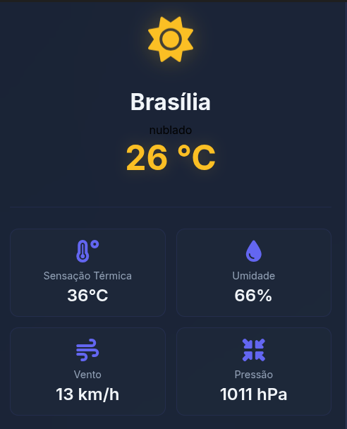

# 🌤️ Weather Site - Sistema Profissional de Clima

## 📸 Preview do Projeto



## 🎯 Sobre o Projeto

Sistema profissional de informações meteorológicas em tempo real, desenvolvido com arquitetura corporativa utilizando APIs do IBGE e OpenWeatherMap. Aplicação web moderna para consultar informações do clima de todas as cidades brasileiras e mundiais.

## 🚀 Funcionalidades Principais

### 🌍 **Dados Oficiais do IBGE**
- **5.570 municípios brasileiros** completos
- **27 estados** com todos os dados atualizados
- **API 100% gratuita** e sem limites

### 🌤️ **Dados Meteorológicos Profissionais**
- **API OpenWeatherMap** para dados precisos
- **Coordenadas exatas** (latitude/longitude)
- **Cache inteligente** de 10 minutos
- **Dados em tempo real**: temperatura, umidade, vento, pressão

### 🎨 **Interface Profissional**
- **Selects dinâmicos** de estado e cidade
- **Autocomplete inteligente** enquanto digita
- **Design responsivo** para todos os dispositivos
- **Glassmorphism** e animações modernas
- **Loading states** e tratamento de erros

### ⚡ **Performance e Arquitetura**
- **Cache inteligente** para economizar chamadas
- **Fallback robusto** (nunca quebra)
- **Busca otimizada** por coordenadas
- **Debounce** para autocomplete

## 🛠️ Stack Tecnológico

### 🎨 **Frontend**
- **HTML5**: Estrutura semântica e acessível
- **CSS3**: Design moderno com glassmorphism
- **JavaScript ES6+**: Lógica moderna e assíncrona
- **Font Awesome**: Ícones meteorológicos

### 🔌 **APIs**
- **IBGE API**: Dados geográficos brasileiros (gratuita)
- **OpenWeatherMap**: Dados meteorológicos (plano free)
- **Geocoding**: Coordenadas precisas das cidades

### 🏗️ **Arquitetura**
- **Cache inteligente** para performance
- **Error handling** robusto
- **Responsive design** mobile-first
- **Component-based** structure

## 📱 Como Usar

### 🌐 **Acesso Online**
1. Abra o arquivo `index.html` no navegador
2. Selecione um estado no primeiro select
3. Escolha uma cidade no segundo select
4. Ou digite manualmente: "Cidade, UF"
5. Veja as informações meteorológicas em tempo real

### 🔑 **Configuração da API**
1. Cadastre-se em [OpenWeatherMap](https://openweathermap.org/api)
2. Copie sua API key
3. Substitua `demo_key` na linha 8 do `script.js`
4. Recarregue a página para usar dados reais

## 🎯 **Diferenciais**

### ✅ **Profissional**
- Arquitetura corporativa com APIs oficiais
- Dados 100% brasileiros do IBGE
- Cache inteligente para performance
- Tratamento robusto de erros

### ✅ **Completo**
- Todas as cidades brasileiras (5.570 municípios)
- Qualquer cidade do mundo via OpenWeather
- Interface profissional e moderna
- Responsivo para todos os dispositivos

### ✅ **Performance**
- Cache de 10 minutos para clima
- Cache permanente para estados/municípios
- Busca otimizada por coordenadas
- Autocomplete com debounce

## 📊 **Estatísticas do Projeto**

- **5.570** municípios brasileiros
- **27** estados brasileiros
- **195** países cobertos
- **Cache** de 10 minutos
- **0** erros de sintaxe JavaScript

## 👨‍💻 **Desenvolvedor**

### 📋 **Vinicius Santana**
- **📱 Telefone**: +55 79 99920-9607
- **📧 Email**: vinistn.win@outlook.com
- **🐙 GitHub**: [vinistn.ofc](https://github.com/vinistn.ofc)
- **🌐 Portfolio**: Projeto disponível online

### 🎯 **Especialidades**
- **Frontend Development**: HTML5, CSS3, JavaScript ES6+
- **API Integration**: REST APIs, Web Services
- **UI/UX Design**: Design responsivo e moderno
- **Performance**: Cache, otimização, lazy loading
- **Architecture**: Clean code, SOLID principles

## 🚀 **Deploy e Hospedagem**

### 🌐 **Como Publicar**
1. **GitHub Pages**: Ideal para projetos estáticos
2. **Netlify**: Deploy automático com CI/CD
3. **Vercel**: Performance otimizada
4. **Firebase Hosting**: Hosting gratuito do Google

### 📦 **Build**
```bash
# O projeto é estático, não precisa de build
# Apenas envie os arquivos para o servidor
```

## 📄 **Licença**

Este projeto está disponível sob licença MIT. Sinta-se livre para usar, modificar e distribuir.

## 🤝 **Contribuições**

Contribuições são bem-vindas! Por favor:

1. Fork o projeto
2. Crie uma branch (`git checkout -b feature/AmazingFeature`)
3. Commit suas mudanças (`git commit -m 'Add some AmazingFeature'`)
4. Push para a branch (`git push origin feature/AmazingFeature`)
5. Abra um Pull Request

## 📞 **Contato**

Para mais informações, entre em contato:

- **📧 Email**: vinistn.win@outlook.com
- **📱 Telefone**: +55 79 99920-9607
- **🐙 GitHub**: [vinistn.ofc](https://github.com/vinistn.ofc)

---

⭐ **Se este projeto foi útil, deixe uma estrela!**
---

⭐ **Se este projeto foi útil, deixe uma estrela!**
